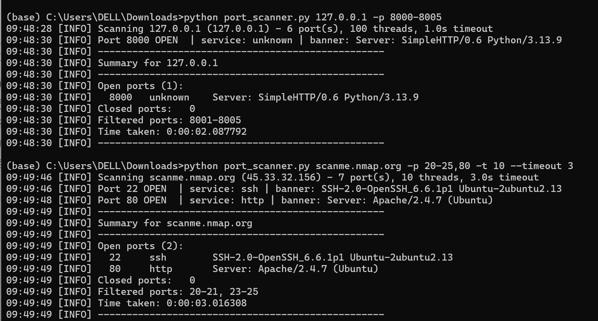

# TCP Port Scanner with Banner Grabbing

A multithreaded TCP port scanner written in Python for the **Syntecxhub Cybersecurity Virtual Internship** (Project 1).

## What It Does

The scanner checks ports on a host and labels each one:

- **OPEN** - a service is listening and accepted the connection
- **CLOSED** - the host answered, but nothing is listening on that port
- **FILTERED** - no answer at all, usually because a firewall is dropping the packets

For every open port it also tries to work out what is running there:

- **Service** - the usual name for that port number (for example 22 -> ssh). This is a lookup-table guess, so it can be wrong if a service uses a non-standard port.
- **Banner** - the text the service sends about itself when you connect (for example `SSH-2.0-OpenSSH_6.6.1`). This is what the service claims, and it often includes the software name and version.

You can scan one port, a range, or a list of ports. Many ports are checked at the same time using a thread pool, so large scans finish quickly. Results are printed on screen and saved to a log file.

## How It Works

1. **Find the IP** - turns a host name into an IP address.
2. **Read the ports** - accepts `80`, `1-1000`, or `22,80,443`, and rejects anything outside 1-65535.
3. **Scan in parallel** - a `ThreadPoolExecutor` runs `scan_port()` for many ports at once. The number of threads is capped (default 100) so the scanner cannot exhaust the operating system's limits.
4. **Classify each port** using `socket.create_connection()`:
   - connection succeeds -> open
   - `ConnectionRefusedError` -> closed
   - timeout -> filtered
   - any other network error -> error
5. **Grab the banner** on open ports: listen briefly for services that talk first (SSH, FTP, SMTP). If nothing arrives, send a small `HEAD / HTTP/1.0` request and read the `Server:` header.
6. **Report and log** - prints a summary and writes everything to a log file using Python's `logging` module.

Each thread returns its own result and only the main thread collects them, so no shared data needs locking.

## Requirements

- Python 3.8 or newer
- No external libraries (standard library only)

## Usage

Run with no arguments and it will ask you questions:

```bash
python port_scanner.py
```

Or give everything on one line:

```bash
python port_scanner.py scanme.nmap.org -p 1-1000
python port_scanner.py 192.168.1.10 -p 22,80,443 -t 50 --timeout 2
```

### Options

| Option | Meaning | Default |
|---|---|---|
| `host` | Host name or IP to scan | asked if left out |
| `-p`, `--ports` | Ports to scan: `80`, `1-1000`, or `22,80,443` | `1-1024` |
| `-t`, `--threads` | How many ports to check at once | `100` |
| `--timeout` | Seconds to wait for each port | `1.0` |
| `--log-file` | File to save results in | `scan_results.log` |

### Example Output

Real run against `scanme.nmap.org` (a host the Nmap project provides for testing):


```
python port_scanner.py scanme.nmap.org -p 20-25,80 -t 10 --timeout 3

Scanning scanme.nmap.org (45.33.32.156) - 7 port(s), 10 threads, 3.0s timeout
Port 22 OPEN  | service: ssh | banner: SSH-2.0-OpenSSH_6.6.1p1 Ubuntu-2ubuntu2.13
Port 80 OPEN  | service: http | banner: Server: Apache/2.4.7 (Ubuntu)
--------------------------------------------------
Summary for scanme.nmap.org
--------------------------------------------------
Open ports (2):
  22     ssh          SSH-2.0-OpenSSH_6.6.1p1 Ubuntu-2ubuntu2.13
  80     http         Server: Apache/2.4.7 (Ubuntu)
Closed ports:   0
Filtered ports: 20-21, 23-25
Time taken: 0:00:03.02
--------------------------------------------------
```

Ports 22 and 80 (SSH and HTTP) came back open, matching what Nmap's own documentation says this host keeps open for testing purposes. The other ports in the range came back filtered rather than closed, most likely because a public test host under load rate-limits or silently drops some connection attempts instead of sending back an explicit refusal for every one.

## Testing

- **Local test servers** were used to check every result type: one server that announces itself immediately (SSH-style), one that only answers an HTTP request, a closed port, and a port that never answers (reported as filtered).
- **Invalid input** (port 70000, non-numeric ports, unknown host, zero threads) prints a clear error and exits without a crash.
- **Real host:** `scanme.nmap.org`, a host the Nmap project provides for scanning practice, is expected to show ports 22 and 80 open.

## Limitations

- The service name comes from a port-number table, not from detection. The banner is more reliable, but a banner is only what the service claims. Administrators can change or hide it.
- Some services send no banner at all.
- Only TCP connect scanning is supported (no UDP, no stealth scans).
- Results can be affected by the network in between: rate-limiting or a firewall can turn a "closed" port into a "filtered" one if connection attempts are dropped instead of refused. This was observed when scanning a public test host with a high thread count.

**Only scan hosts you own or that explicitly allow scanning, such as `scanme.nmap.org`. Scanning other systems without permission can be illegal.**

## Concepts Demonstrated

- TCP socket programming
- Concurrency with `ThreadPoolExecutor`
- Service fingerprinting through banner grabbing
- Command-line tools with `argparse`
- Logging with the `logging` module
- Input validation and error handling

## Author

Tooba - Syntecxhub Cybersecurity Internship, Project 1: Port Scanner.
